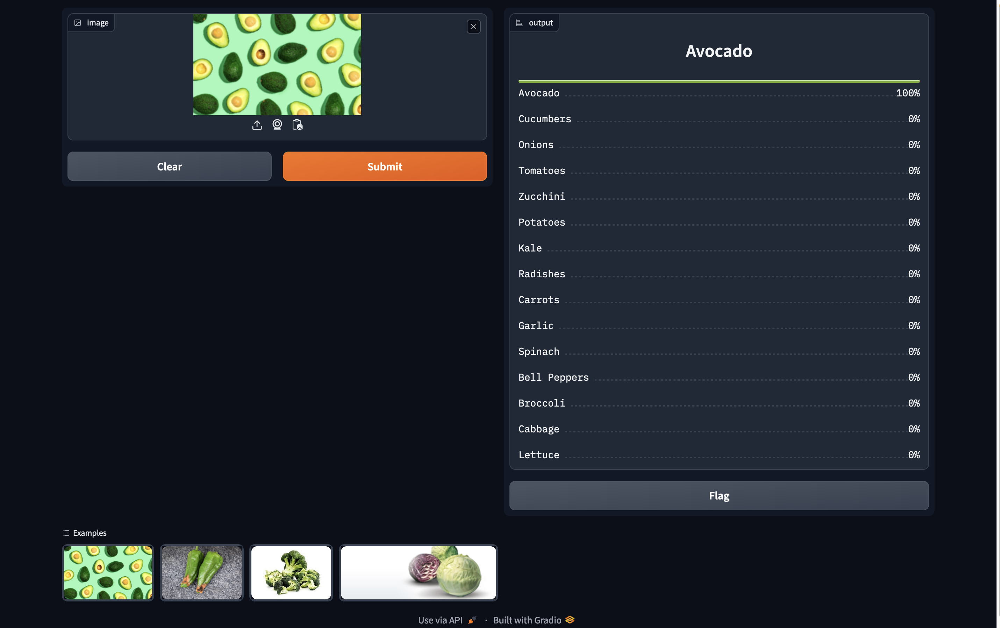

# Veg_Recognizer
An image classification model from data collection, cleaning, model training, deployment and API integration.  
The model can classify 15 different types of vegetables  
The types are following:  
1. Carrots
2. Tomatoes
3. Lettuce
4. Spinach
5. Broccoli
6. Cucumbers
7. Bell Peppers
8. Potatoes
9. Onions
10. Garlic
11. Zucchini
12. Cabbage
13. Kale
14. Radishes
15. Avocado

# Dataset Preparation
**Data Collection:** Downloaded from DuckDuckGo using term name  
**DataLoader:** Used fastai DataBlock API to set up the DataLoader.  
**Data Augmentation:** fastai provides default data augmentation which operates in GPU.  
Details can be found in `notebooks/Vegetable_Recognizer(Data_Prep).ipynb`

# Training and Data Cleaning
**Training:** Fine-tuned a resnet34 model for 5 epochs (3 times) and got upto ~85% accuracy.  
**Data Cleaning:** This part took the highest time. Since I collected data from browser, there were many noises. Also, there were images that contained. I cleaned and updated data using fastai ImageClassifierCleaner. I cleaned the data each time after training or finetuning, except for the last time which was the final iteration of the model.  

# Model Deployment
I deployed to model to HuggingFace Spaces Gradio App. The implementation can be found in `deployment` folder or [here](https://huggingface.co/spaces/Sadihsn/Vegetable_Recognizer).  

# API integration with GitHub Pages
The deployed model API is integrated [here](https://sadihsn.github.io/Veg_Recognizer/) in GitHub Pages Website. Implementation and other details can be found in `docs` folder.

